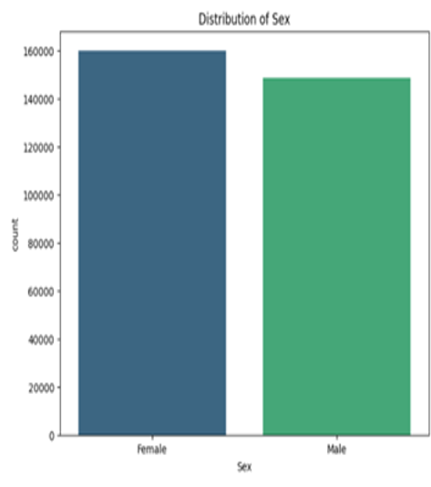
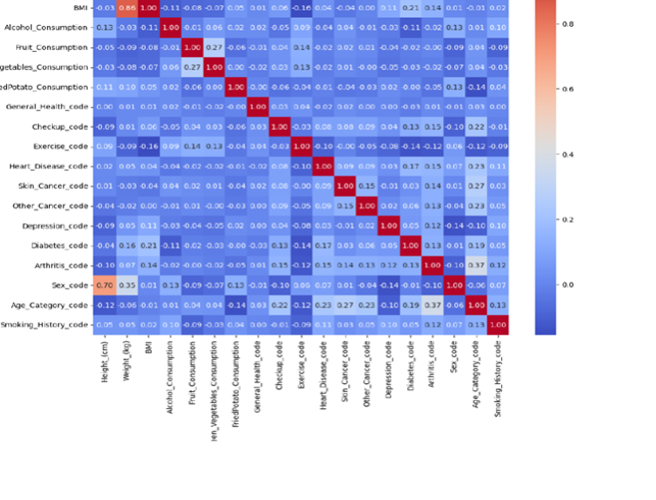

# Cardiovascular Risk Prediction project

**Description:**  
This project predicts cardiovascular risk by leveraging advanced machine learning and deep learning techniques to uncover complex nonlinear relationships in lifestyle and health data, aiming to improve early detection and personalized risk assessment.

## Aim / Objectives  
- Explore advanced ML/DL models to improve cardiovascular risk prediction.  
- Capture complex relationships between lifestyle factors and cardiovascular outcomes.  
- Provide insights for early detection and personalized health recommendations.

## Data

This project uses health and lifestyle data to predict cardiovascular risk. 

- **Source:** [Mention source if public, or “Proprietary dataset” if private]  
- **Content:** The dataset includes features such as age, gender, BMI, blood pressure, cholesterol levels, smoking habits, physical activity, and other lifestyle factors.  
- **Size:** Number of records and features (e.g., 5,000 rows × 15 columns).  
- **Preprocessing:** Missing values were handled, categorical features encoded, and data normalized before modeling.  

> Note: For privacy reasons, a **sample dataset** or synthetic data is included in the repository to demonstrate model functionality.

## Methods / Approach  
- **Data preprocessing:** Cleaned and structured health and lifestyle datasets.  
- **Models used:**  
  - Extreme Gradient Boosting (XGBoost)  
  - Deep Neural Networks (DNNs)  
  - Keras Neural Networks with KerasTuner for hyperparameter optimization  
- **Evaluation:** Compared model performance using metrics like accuracy, recall, and ROC-AUC.

## Visuals
Key visualizations included in the `images/` folder:
- Feature Importance: 
- Correlation Heatmap: 

## Key Findings  
- Advanced ML/DL models effectively capture nonlinear patterns in cardiovascular risk factors.  
- Deep learning models showed improved accuracy and recall over traditional models.  
- Gradient boosting offered scalable and interpretable performance.
## Project Structure

cardiovascular-risk-prediction/
```
├── README.md                      # Project description and summary
├── notebooks/                     # Jupyter notebooks with analysis & key modeling snippets
│   ├── data_preprocessing.ipynb
│   ├── model_xgboost.ipynb
│   └── dnn_model.ipynb
├── src/                            # Python scripts for reusable functions and model training
│   ├── utils.py
│   └── train_model.py
├── models/                         # Saved model files (optional)
│   └── xgboost_model.pkl
├── images/                         # Visualizations from analysis
│   ├── feature_importance.png
│   └── correlation_heatmap.png
├── requirements.txt                # Python dependencies

```
## Usage

### 1. Clone the repository
```
git clone <your-repo-URL>
cd cardiovascular-risk-prediction.
```
 ### 2. Install dependencies
```
pip install -r requirements.txt
```

### 3. Run the project
```
from xgboost import XGBClassifier
from src.train_model import load_sample_data  # optional helper function

# Load sample data
X_train, X_test, y_train, y_test = load_sample_data()

# Train model
model = XGBClassifier(n_estimators=100, max_depth=4)
model.fit(X_train, y_train)
y_pred = model.predict(X_test)
```
You can run notebooks from the `notebooks/` folder or Python scripts from the `src/` directory.

 ## License
This project is licensed under the [MIT License](LICENSE) – see the LICENSE file for details.

